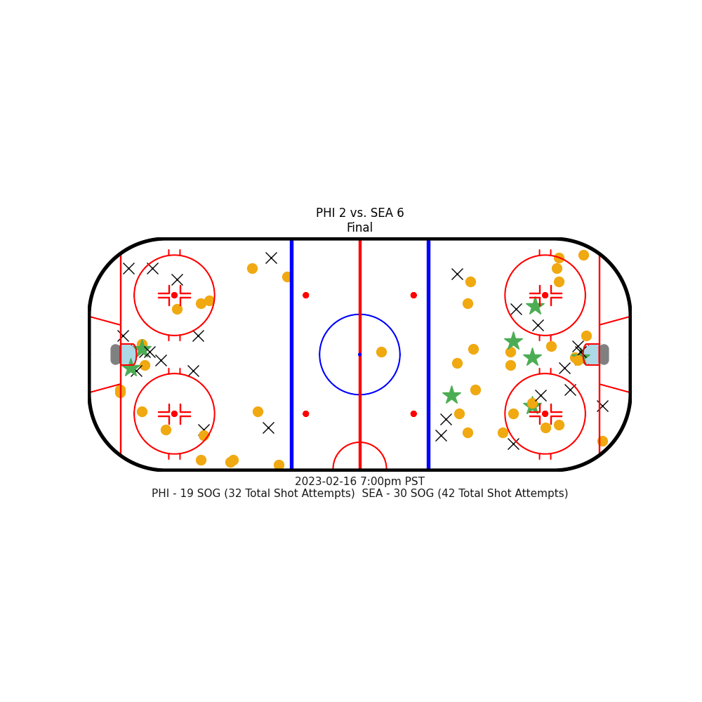
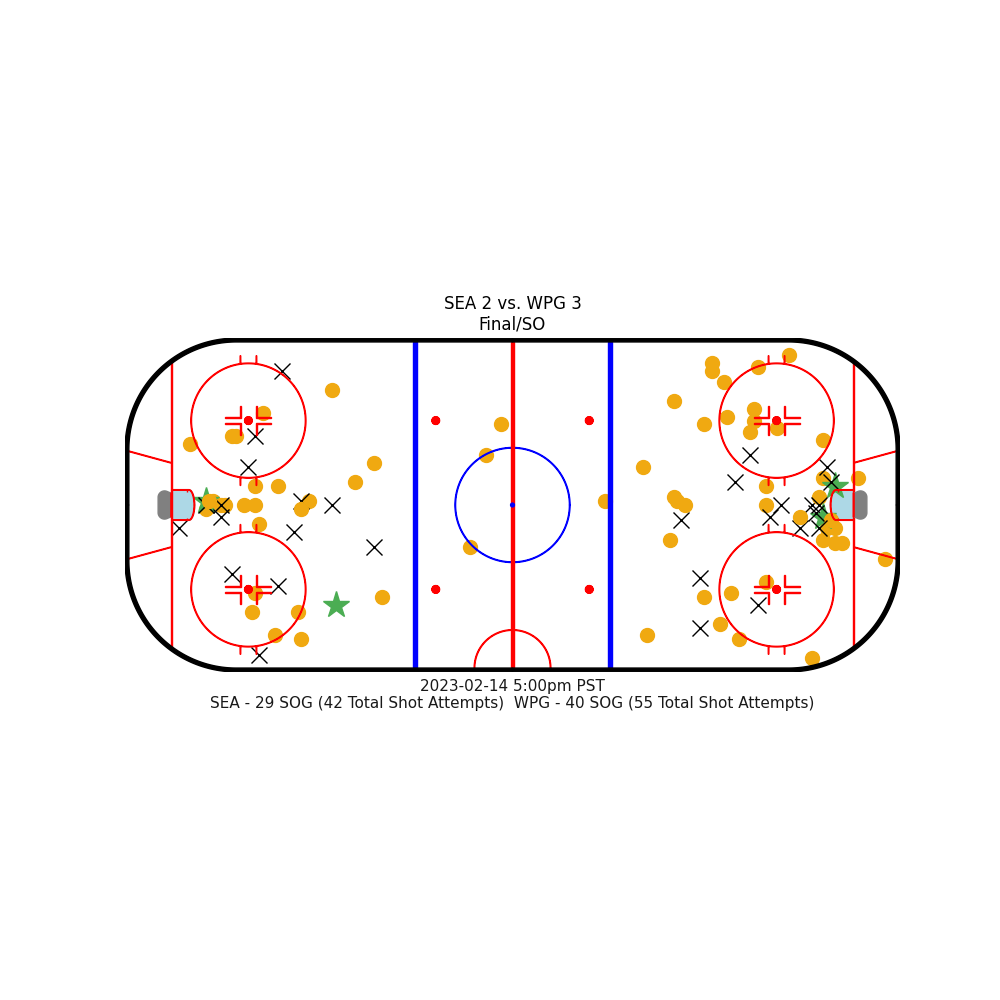
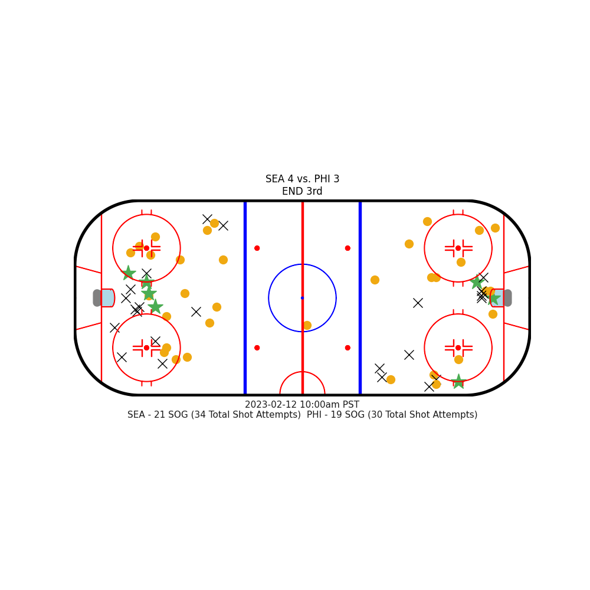

# Welcome

This project will explore getting started developing with [Python](https://www.python.org) and the National Hockey League (NHL) API.

The example Python script at [./NHLShotChart.py](./NHLShotChart.py) will allow you to generate charts using a game ID from the NHL API to see where players either had a goal or a shot on goal. You can optionally enable displaying all shot attempts, as well.





## Local development

### Install dependencies and run our project

```sh
# Verify that you have Python installed on your machine
% python3 --version
Python 3.11.1

# Create a new virtual environment for the project
% python3 -m venv .venv

# Select your new environment by using the Python: Select Interpreter command in VS Code
#   - Enter the path: ./.venv/bin/python

# Activate your virtual environment
% source .venv/bin/activate
(.venv) %

# Install Python packages in a virtual environment
# EXAMPLE: Install simplejson - https://pypi.org/project/simplejson/
# % pip install simplejson
# ... continue to install packages as needed ...

# When you are ready to generate a requirements.txt file
# % pip freeze > requirements.txt

# What happens if you want to uninstall a package?

# Uninstall the package from your virtual environment
# % pip uninstall simplejson

# Remove the dependency from requirements.txt if it exists
# % pip uninstall -r requirements.txt

# Install the packages from requirements.txt
(.venv) % pip install -r requirements.txt
```

That's it! Now, if you re-run the program - with or without the debugger - your Python script should have executed.
