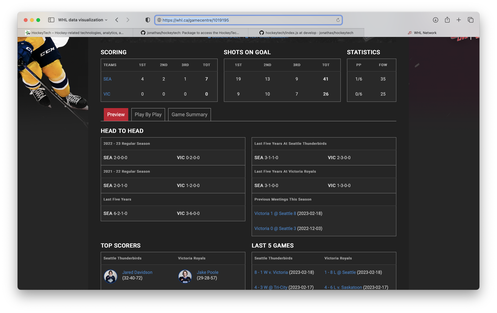

# Welcome

This example will explore getting started developing with the [R](https://www.r-project.org) programming language as quickly as possible using [RStudio](https://posit.co/products/open-source/rstudio/) and data from the [Western Hockey League](https://whl.ca) (WHL) API.

## What network calls are made behind the scenes for a game?
Following tonight's train of thought, let's take a peek and see what data we're working with after the conclusion of tonight's game.

Here is an [example game](https://whl.ca/gamecentre/1019195) between the Seattle Thunderbirds and Victoria Royals on Monday, February 20th, 2023:

### WHL Scorebar
The WHL Scorebar is our lone Module Kit example - with a reference JSON data response for review [here](./__reference/whl_scorebar.json)

### WHL game preview & HockeyTech configuration
This example contains a reference JSON data response for review [here](./__reference/whl_game_preview_and_hockeytech_configuration.json)

### WHL play-by-play
This example contains a reference JSON data response for review [here](./__reference/whl_play_by_play.json)

### WHL game center clock and quick links
This example contains a reference JSON data response for review [here](./__reference/whl_game_center_clock_and_quick_links.json)

### WHL game summary
This example contains a reference JSON data response for review [here](./__reference/whl_game_summary.json)

